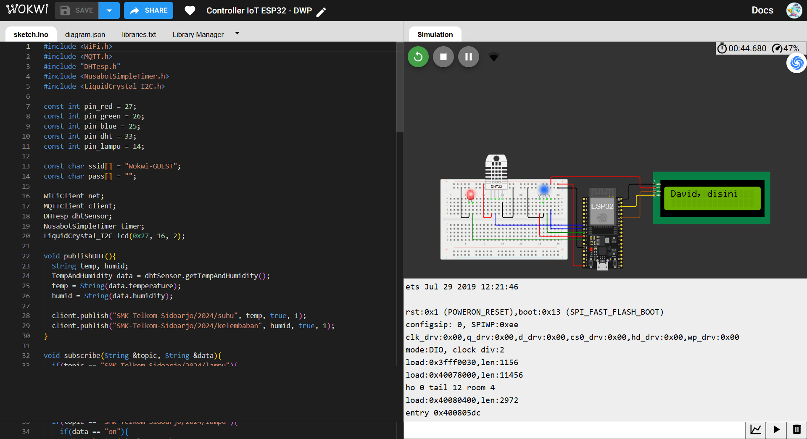

# Client IoT Device using Wokwi

This repository contains simple projects about IoT dashboards and IoT clients using Wokwi to run virtual ESP32.
You can access the IoT client project at this link [Project](https://wokwi.com/projects/410777124638740481)

### Wokwi ESP32

